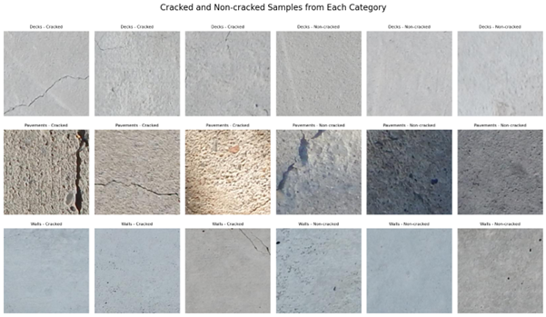
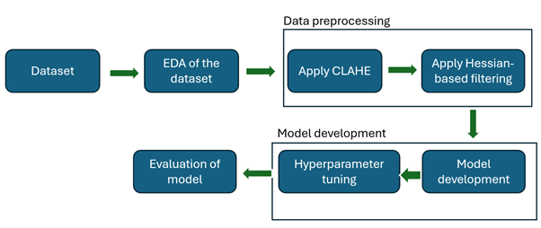

# Structural Crack Detection Using EfficientNet Model

## Project Overview

This project develops a deep learning framework for **automatic detection of cracks in concrete and masonry structures**.  
By leveraging **image preprocessing (CLAHE + Hessian-based filtering)** and **EfficientNetB0**, this project achieves high accuracy with reduced computational cost, making it suitable for **real-time and mobile applications**.

Dataset used: **SDNET2018** (56,000+ annotated images of cracked and non-cracked surfaces).  
Link: [SDNET2018 Dataset](https://www.kaggle.com/datasets/aniruddhsharma/structural-defects-network-concrete-crack-images)



---

## 🛠 Methodology

1. **Dataset Preparation** – SDNET2018 dataset, binary classification (Cracked vs Non-cracked).
2. **EDA** – Class imbalance, pixel intensity, PCA.
3. **Image Preprocessing** – CLAHE (contrast enhancement) + Hessian-based filtering (crack-like structures) and image augmentation.
4. **Model Development** – EfficientNetB0 with transfer learning, compared against VGG16.
5. **Evaluation** – Accuracy, Precision, Recall, F1-score, Inference time, Memory usage.



---

## Results Summary

- **Without Preprocessing**

  - VGG16: 87% accuracy
  - EfficientNetB0: 94% accuracy

- **With CLAHE + Hessian Preprocessing**

  - VGG16: 94% accuracy
  - **EfficientNetB0: 98% accuracy**

- **Efficiency**

  - Inference Time: ~20s (EfficientNetB0) vs ~52s (VGG16)
  - Memory Usage: ~58 MB (EfficientNetB0) vs ~77 MB (VGG16)

  **Best Model:** EfficientNetB0 + Preprocessing


---

## Requirements

All dependencies are listed in `requirements.txt`.

````txt
tensorflow==2.15.0
keras==2.15.0
opencv-python==4.9.0.80
scikit-image==0.22.0
scikit-learn==1.3.2
matplotlib==3.8.2
pillow==10.1.0
tqdm==4.66.1
pandas==2.1.3
numpy==1.26.2
keras-tuner==1.4.6
````
---

##  Installation

1. **Install Anaconda**
   Download and install **Anaconda (Python 3.11 recommended)** from:
   👉 [https://www.anaconda.com/download](https://www.anaconda.com/download)

2. **Clone Repository & Install Dependencies**

```bash
git clone <your-repo-link>
cd <repo-folder>
pip install -r requirements.txt
```
3. **Launch Jupyter Notebook**

```bash
jupyter notebook "Finalcode (1).ipynb"
```
and run all the cells


````
